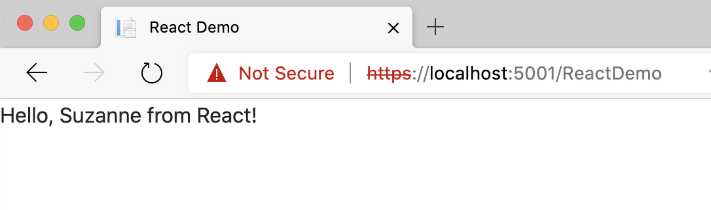

# Composite UI
The goal of this proof of concept (POC) is to show how an existing or new ASP.NET Core Web application can be extended by using UI components developed using different frontend technologies.
In this POC we start a ASP.NET Core MVC application from scratch, but the techniques show here can easilz be applied to an existing MVC application. Let's start:

1. Create a new folder `CompositeUIDemo` and navigate to it
    ```
    mkdir CompositeUiDemo && cd CompositeUiDemo
    ```

1. Now create an ASP.NET Core 3.1 application and navigate to it
    ```
    dotnet new mvc --output web
    cd web
    ```

1. To make sure everything is OK we can run the application in watch mode:
    ```
    dotnet watch run
    ```
    Note that whenever you will make some changes to the files of the web app and save them, the application will restart automatically. This is exactly what we want...

1. We can then access the application with a browser at https://localhost:5001.

## React Component
Now we want to add a page to this application which uses a React based component. 

1. To add this React based component we need to add a few NuGet packages. On my MacBook I do the following:

    ```
    dotnet add package react.aspnet
    dotnet add package JavaScriptEngineSwitcher.ChakraCore
    dotnet add package JavaScriptEngineSwitcher.ChakraCore.Native.osx-x64
    dotnet add package JavaScriptEngineSwitcher.Extensions.MsDependencyInjection
    ```

1. Please note that if you're running the app on a Windows or Linux (e.g. WSL2) machine you need to add a different native package (3rd above). It is one of the following:

    ```
    JavaScriptEngineSwitcher.ChakraCore.Native.win-x86
    JavaScriptEngineSwitcher.ChakraCore.Native.win-x64
    JavaScriptEngineSwitcher.ChakraCore.Native.win-arm
    JavaScriptEngineSwitcher.ChakraCore.Native.linux-x64
    JavaScriptEngineSwitcher.ChakraCore.Native.osx-x64
    ```

1. To wire up React we need to modify the `Startup` class in the root folder of our web application:
    1. Add the following `using` statements to the top of the class:
        ```
        using Microsoft.AspNetCore.Http;
        using JavaScriptEngineSwitcher.ChakraCore;
        using JavaScriptEngineSwitcher.Extensions.MsDependencyInjection;
        using React.AspNet;
        ```
    1. Add the follwing statements at the beginning of the `ConfigureServices` method:
        ```
        services.AddSingleton<IHttpContextAccessor, HttpContextAccessor>();
        services.AddReact();
        // Make sure a JS engine is registered, or you will get an error!
        services.AddJsEngineSwitcher(options => 
            options.DefaultEngineName = ChakraCoreJsEngine.EngineName)
            .AddChakraCore();
        ```
    1. Add the following snippet just before the `app.UseStaticFiles` statement in the method `Configure`:
        ```
        app.UseReact();
        ```

And with that, we are ready to implement and use our first React component. To do so, let's implement a simple `HelloWorld` component for the Home page:

1. Create a new Controller `Controllers/ReactDemoController` class such as that it looks like this:
    ```
    public class ReactDemoController : Controller
    {
        public IActionResult Index()
        {
            return View();
        }
    }
    ```
1. Add a file `Views/ReactDemo/Index.cshtml` with the following content:
    ```
    <html>
    <head>
    <title>React Demo</title>
        <link rel="stylesheet" href="https://cdn.jsdelivr.net/npm/bootstrap@4.5.3/dist/css/bootstrap.min.css" integrity="sha384-TX8t27EcRE3e/ihU7zmQxVncDAy5uIKz4rEkgIXeMed4M0jlfIDPvg6uqKI2xXr2" crossorigin="anonymous">
    </head>
    <body>
        <div id="content"></div>
        <script crossorigin src="https://cdnjs.cloudflare.com/ajax/libs/react/16.13.0/umd/react.development.js"></script>
        <script crossorigin src="https://cdnjs.cloudflare.com/ajax/libs/react-dom/16.13.0/umd/react-dom.development.js"></script>
        <script src="https://cdnjs.cloudflare.com/ajax/libs/remarkable/1.7.1/remarkable.min.js"></script>
        <script src="@Url.Content("~/js/reactDemo.jsx")"></script>
    </body>
    </html>
    ```
1. Finally add a file `wwwroot/js/reactDemo.jsx` with this content:
    ```
    class HelloWorld extends React.Component {
        render() {
            return (
                <div className="helloWorld">
                    Hello, {this.props.name} from React!
                </div>
            );
        }
    }

    ReactDOM.render(
        <HelloWorld name="Suzanne"/>, 
        document.getElementById('content')
    );
    ```

1. To test the whole navigate to https://localhost:5001/reactDemo
    


## Vue JS

## Angular

## Asp.Net Core ViewComponent
